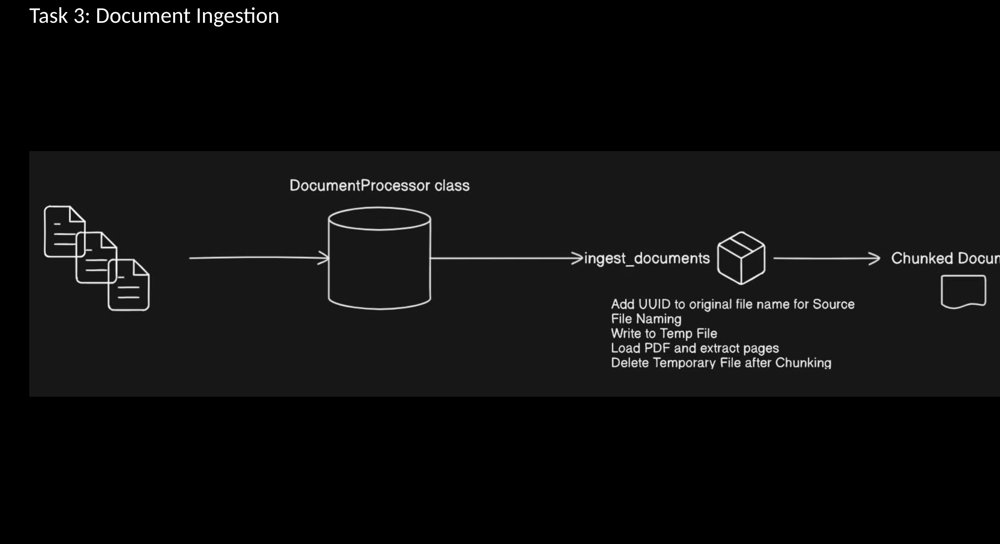
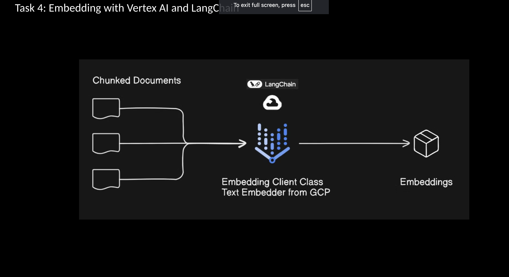
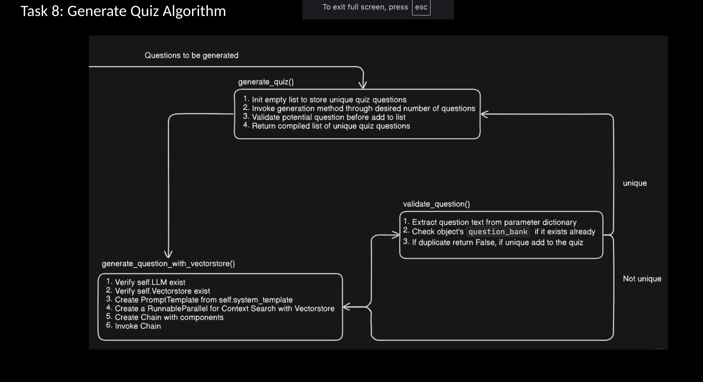
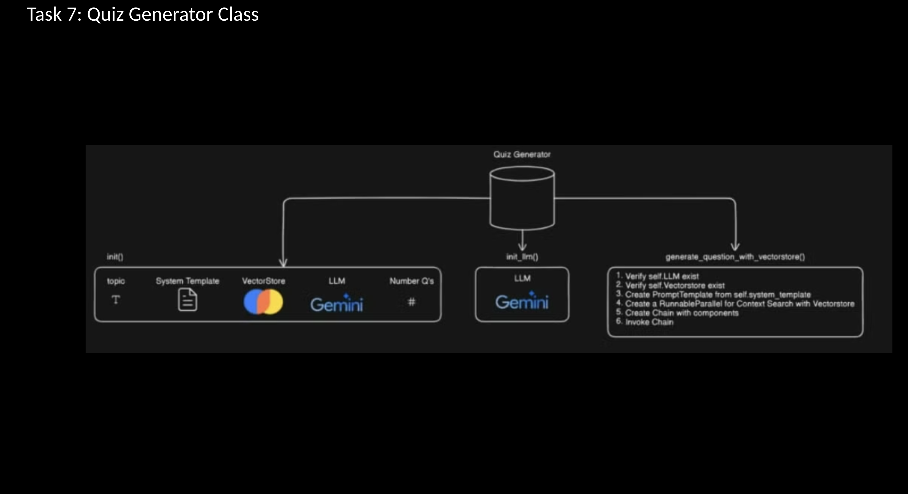
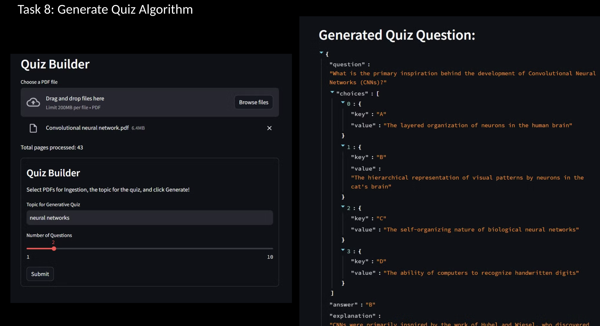
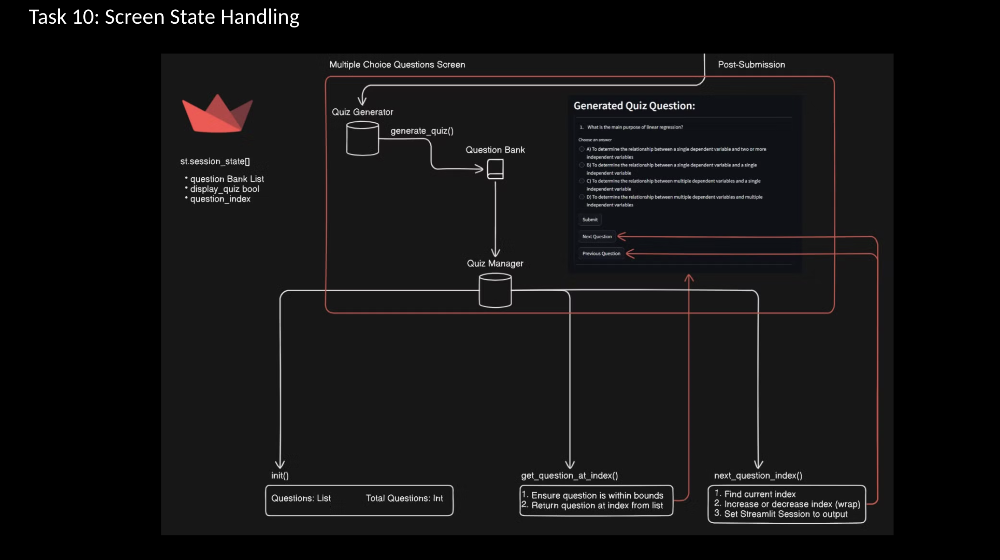
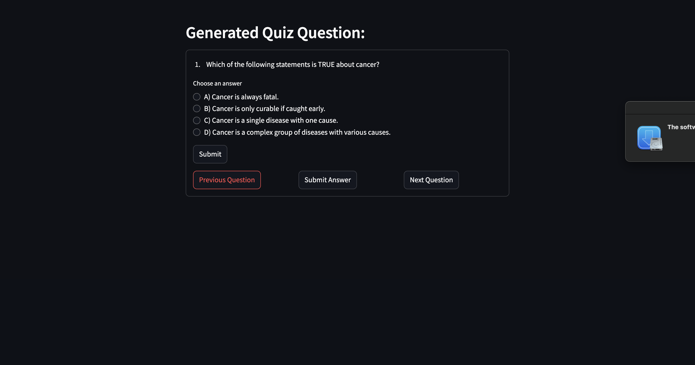

# Gemini-AI-Quizify

This project implements a **Quiz Builder** using various advanced technologies, including **Google Gemini**, **Vertex AI API**, **embeddings**, **Google Service Account**, **Langchain**, **PDF loader**, and **Streamlit**. The project is part of challenges provided by **Radical AI**, with specific contributions made towards various implementation steps.

## Description

The **Quiz Builder** automatically generates quizzes from input documents and user-specified topics. It leverages machine learning models for text embeddings, using Google's **Gemini** and **Vertex AI API** for processing documents and generating quiz questions. The project also includes a **Streamlit-based user interface** for interactive and user-friendly quiz generation.

## Features
- **Document Processing**: Uses **Google Gemini** for processing.
- **Text Embeddings**: Embeddings are generated with **Langchain**.
- **Authentication**: Secure API access through **Google Service Account**.
- **PDF Ingestion**: Documents loaded via **PDF loader**.
- **User Interface**: Built with **Streamlit** for a smooth user experience.
- **Quiz Generation**: Quizzes created based on user-specified topics.
- **Answer Explanations**: Provides detailed explanations for each quiz answer.
- **Navigation Controls**: Implements quiz interface navigation for seamless interaction.
- **Error Handling**: Robust error handling and validation.
- **Deployment**: Packaging and deployment strategies considered.

## Tasks Covered
By implementing the script files, the following tasks are accomplished:
1. **Document Processing**: Using **Google Gemini**.
2. **Embeddings**: Generated using **Langchain**.
3. **Authentication**: Handled via **Google Service Account**.
4. **PDF Loading**: Done with a **PDF loader**.
5. **User Interface**: Developed using **Streamlit**.
6. **Quiz Generation**: Based on user input.
7. **Answer Explanations**: Provided for each quiz answer.
8. **Navigation Controls**: User-friendly quiz navigation.
9. **Error Handling**: Implemented throughout the app.
10. **Deployment**: Packaged for efficient deployment.

## Installation

To set up the Quiz Builder locally:

1. **Clone the repository**:
   ```bash
   git clone <repository-url>
2. **Navigate to the project directory:
   ```bash
    cd MISSION-QUIZIFY
3. **nstall the necessary dependencies:
   ```bash
      pip install -r requirements.txt

4. **Replace Project ID: Use the unique project ID from your AI model (in this case, Vertex AI Google Gemini was used over Google Cloud).          

## Usage
1. **Start the Streamlit application:
   ```bash
      streamlit run <your_script>.py
    Replace <your_script> with the name of the Python script.

## Screenshots and Illustrations

1. **Document Ingestion**:
   


2. **Embedding Client**:
   

3. **Algorithm**: 
      

4. **Quiz Generation**:
   

5. **Quiz Format**:
   

5. **Screen State Handling**:
   

6. **Example Program Output**:
   

## Contributions

If you would like to contribute to this project, please follow these steps:

1. **Fork the repository**: Click the "Fork" button on the top-right of the repository page to create a copy of the repository under your GitHub account.
2. **Clone your fork**: Clone your forked repository to your local machine.
   ```bash
   git clone <your-fork-repository-url>
